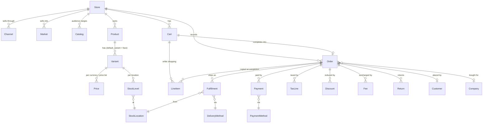

# Spree Data Model (Spree 6)

A relationship map of the models you'll touch most. Field-level detail lives in `node_modules/@spree/docs/dist/developer/core-concepts/*.md`; when in doubt, read `server/`'s installed gem source (`bundle exec gem contents spree_core`, or `spree exec bundle show spree_core`).

## The big picture



All models are `Spree::*`, inherit `Spree.base_class`, carry a prefixed ID, and are store-scoped unless noted. **No model has a state machine** — lifecycle fields are string `status` columns (`has_status`) moved by workflows.

## 1. Commerce axis — Store, Channel, Market, Catalog

| Model | What it is | Key points |
|---|---|---|
| `Store` (`store_`) | The tenant boundary — its own catalog, orders, settings | Query through it: `store.products`, `store.orders`. `Spree::Store.default` may be nil; `Spree::Current.store` is the request's store |
| `Channel` (`ch_`) | *Where* an order comes from — online, POS, wholesale portal, app | One default per store ("Online Store"). Resolved per request from `X-Spree-Channel` (code or `ch_` id). `ProductPublication` (`pp_`) decides which products a channel lists; orders carry `channel_id` |
| `Market` (`mkt_`) | *Region* a store sells into — countries + currency + locales + tax-inclusive flag + tax provider | Resolved from the customer's country; falls back to the default market |
| `Catalog` (`cat_`) | *What an audience sees and pays* | `CatalogProduct` = assortment (empty ⇒ pricing overlay only; non-empty ⇒ restricted range), optional `PriceList`, `CatalogAssignment` to a `CustomerGroup` or `Company`, plus quantity rules and order minimums. A channel may have a `default_catalog` |

**Adding a store in code** (a platform provisioning merchants): creating a `Spree::Store` row only gets its default policies and delivery profile. Seed what it needs to trade with `Spree::Seeds::StoreResources.call(store: store)` — tax categories, channels (incl. `wholesale`), roles, digital delivery, payment methods, product types, customer groups, returns setup, commission rate, seller requirements, API keys, saved reports, allowed origins; per-store and safe to re-run, never touches other stores. Then, once you know where the merchant ships from, `Spree::Stores::ProvisionDefaults.call(store:, country:, locale: nil, currency: nil)` builds the default market, warehouse, delivery zones and pickup (first-time only — on a configured store it reads as a data reset). Demo data for that store: `bin/rails spree:load_sample_data STORE_CODE=<code>` (or `STORE_ID=store_…`) or `Spree::SampleData::LoadJob.perform_later(store.id)`.

## 2. Catalog — products and what hangs off them

| Model | Notes |
|---|---|
| `Product` (`prod_`) | `status`: `draft` / `active` / `archived` (+ `proposed` / `rejected` for marketplace review). Belongs to `ProductType`, `DeliveryProfile`, optional `Seller`, `TaxCategory` |
| `Variant` (`variant_`) | The buyable SKU. **No master variant** — every product has ≥1 variant and a real FK `product.default_variant` (`default_variant_id`), the variant that fronts price/SKU/weight for single-variant products |
| `Price` (`price_`) | `amount`, `compare_at_amount`, `currency`, optional `price_list_id`. Read/write via `variant.price_in('EUR')`, `variant.amount_in('EUR')`, `variant.set_price('EUR', 19.99, 24.99)` — there is no `variant.price` |
| `PriceList` (`pl_`) + `PriceRule` | Conditional price overrides; `status` `draft` / `active` / `inactive` / `scheduled`. See `spree-pricing` |
| `Category` (`ctg_`) | Store-owned **tree** (nested set) for navigation; products join via `ProductCategory` |
| `Collection` (`coll_`) | **Flat**, manual or rule-based (`CollectionRule`) product grouping for merchandising |
| `OptionType` (`opt_`) / `OptionValue` (`optval_`) | Size/Color; display text is `label` (not `presentation`); `option_type.color_swatch?` |
| `ProductType` (`pt_`) | Template: which option types, categories, custom field definitions and delivery profile a kind of product uses |
| `Media` (`media_`) | Images/videos, polymorphic `viewable`; `product.primary_media`; variants link through `VariantMedia` |
| `CustomFieldDefinition` (`cfdef_`) / `CustomField` (`cf_`) | Merchant-defined typed attributes on products, customers, orders…; store-scoped definitions; `storefront_visible`; `record.set_custom_field('custom.material', 'Cotton')` / `get_custom_field('custom.material')` |

Integration data that nobody edits goes in `metadata` (JSON, every major model), not custom fields. A cart's `metadata` is copied onto the order(s) it becomes at completion — and it's customer-writable through the Store API, so don't trust keys that came from it.

## 3. Buyer — Customer, Company, CustomerGroup, Address

- **Customer** (`Spree.customer_class`, default `Spree::Customer`, `cust_`) — the shopper account. **Customers are global** (not store-owned); store-specific standing (groups, companies) is evaluated per store. Has `orders`, `carts` (open `Spree::Cart`s), `addresses`, `store_credits`, `gift_cards`, `wishlists`, `customer_groups`, `companies` (through `CompanyMembership`). Staff are a separate class: `Spree.admin_user_class` (`adm_`).
- **Company** (`comp_`) — a B2B buyer organization, store-scoped, a **tree** up to five levels (`parent` / `children`); nodes are `kind` `company` (legal entity, may hold `TaxIdentifier`s) or `division`. Members via `CompanyMembership` (`cmem_`) with company roles; invites via `CompanyInvitation`. Carts/orders carry `company_id`. See `spree-b2b`.
- **CustomerGroup** (`cg_`) — store-scoped segment used by catalogs, promotions and price rules.
- **Address** (`addr_`) — polymorphic `owner` (customer or company address book). Fields `first_name`, `last_name`, `address1/2`, `city`, `postal_code`, `country_code`, `state_code`, `phone`, `company`.

## 4. Purchase — Cart → Order

| | `Spree::Cart` (`cart_`) | `Spree::Order` (`or_`) |
|---|---|---|
| Purpose | Mutable checkout state | Financial record — immutable once `placed` (`draft` orders from admin/B2B edit flows stay editable) |
| Lifecycle field | none — only `completed_at` (set when completed) | `status`: `draft` → `placed` / `canceled` (plus derived `payment_status`, `fulfillment_status`) |
| Changes via | `Spree::Carts::*` workflows (AddItem, UpsertItems, Recalculate, Complete, Merge) | `Spree::Orders::*` workflows (Cancel, admin edit twins); statuses only via `Spree::Orders::UpdateStatuses` |
| Store API | `/api/v3/store/carts` | `/api/v3/store/orders` (read), Admin API for management |

- `Spree::Carts::Complete` is the single hard gate: it re-prices, checks `Spree::Checkout::Requirements`, processes payment, and copies the cart into a new Order (`order.cart_id`; `cart.order`). The cart is kept with `completed_at` set. Checkout "steps" are advisory, derived from outstanding requirements.
- Shared behavior lives in **`Spree::Purchase::*` concerns** included by both (`Addresses`, `Currency`, `Market`, `Channel`, `Company`, `Taxation`, `Totals`, `PaymentProcessing`, `StoreCredits`, `GiftCards`, `Validations`, `Lifecycle`, `DigitalItems`, `QuantityRules`, `PurchaseOrder`, `Freight`, …; `CheckoutSteps` is cart-only). Code meant for both takes "a purchase", not an order.
- **Dual owner FKs:** `LineItem`, `Fulfillment`, `Payment`, `PaymentSession`, `TaxLine`, `Discount`, `Fee`, `StockReservation` carry both `cart_id` and `order_id` (exactly one set). Always read **`record.owner`** — never assume `.order`.
- **LineItem** (`li_`) — variant, quantity, unit price captured into the row (plus `price_list_id`, `seller_id`); has its own tax lines, discounts, fees, fulfillment items.
- `payment_status`: `none`, `authorized`, `partially_paid`, `paid`, `partially_refunded`, `refunded`, `overcharged`, `voided`. `fulfillment_status`: `unfulfilled`, `backorder`, `partial`, `fulfilled`, `delivered`, `canceled` (the validator also accepts legacy `pending`, `ready`, `shipped`, which only appear on migrated rows — tolerate them when reading, removed in 6.1). Never write these yourself.
- Querying: `store.orders.placed_orders`, `.canceled_orders`, `.drafts`; API `q[status_eq]=placed`. Carts: `store.carts.incomplete`.

## 5. Money rows — TaxLine, Discount, Fee

There is no generic adjustment table. Three typed rows (shared concern `Spree::TypedAdjustmentLine`: `amount`, `label`, `metadata`, cart/order owner):

| Row | Attaches to | Notes |
|---|---|---|
| `TaxLine` (`tl_`) | line item, fulfillment or fee | `included` (in-price) vs additional; keeps rate/label snapshot; `tax_rate` optional (provider-computed tax) |
| `Discount` (`disc_`) | line item or fulfillment | `promotion` / `promotion_action` snapshot; applied promotions tracked by `OrderPromotion` |
| `Fee` (`fee_`) | line item, fulfillment, or the purchase itself | surcharges, duties, handling |

Totals on the purchase: `item_total`, `discount_total`, `delivery_total`, `fee_total`, `tax_total` (= `included_tax_total` + `additional_tax_total`), `total`, `amount_due`. **`Spree::Carts::RecalculateTotals`** is the one seam that regenerates rows on a cart. **Placed orders are money-frozen**: `Spree::Orders::RecalculateTotals` re-sums existing rows and never re-applies today's promotions or rates. See `spree-order-totals`, `spree-taxes`.

## 6. Fulfillment, inventory and after-sales

- **Fulfillment** (`ful_`) — one parcel from one `StockLocation` via one `DeliveryMethod`; `status` `unfulfilled` → `fulfilled` → `delivered`, or `canceled` (final — no resume). Number derived from the order (`R1001-F1`). Items are `FulfillmentItem` (`fi_`, `on_hand` / `backordered` / `shipped` / `returned`). Candidate rates are `DeliveryRate` (`dr_`). Carrier journeys are `Delivery` (`dlv_`) rows; labels are `ShippingLabel` (`lbl_`).
- **Delivery setup:** `DeliveryProfile` (`fp_`, how a product ships; products reference one) → `DeliveryOriginGroup` (`og_`) → `DeliveryZone` (`dz_`) + `DeliveryMethod` (`dm_`, with a calculator, rules and a fulfillment provider type — shipping, digital, pickup).
- **Inventory:** `StockLocation` (`sloc_`) ↔ `StockLevel` (`sl_`, one per variant per location: `count_on_hand`, `backorderable`, reserved/allocated/incoming counts) → `StockMovement` (`sm_`); checkout holds via `StockReservation` (`res_`); `StockTransfer` (`st_`) and `PurchaseOrder` (`po_`) move stock in. See `spree-inventory`, `spree-fulfillment`.
- **After-sales:** `Return` (`ret_`, `requested` → `approved` → `received` → `refunded` | `canceled`) with `ReturnLineItem`; `Exchange` (`exch_`, `requested` → `approved` → `received` → `fulfilled` | `canceled`); `Claim` (`claim_`, `open` → `approved` → `resolved` | `denied` / `canceled`). Each transition is a workflow (`Spree::Returns::*`, …). See `spree-returns`.

## 7. Payments

- **PaymentMethod** (`pm_`) — store-scoped gateway config (STI subclasses, preferences for credentials).
- **PaymentSession** (`ps_`) — provider-side session (Stripe PaymentIntent, Adyen session…) for session-based methods; `status` `pending` / `processing` / `completed` / `failed` / `canceled` / `expired`. `PaymentSetupSession` (`pss_`) saves a method for later.
- **Payment** (`py_`) — `status` `checkout` / `processing` / `pending` (authorized) / `completed` (captured) / `failed` / `void` / `invalid`; polymorphic `source` (`CreditCard` `card_`, `PaymentSource` `psrc_`, `StoreCredit`, …). Number derived from the order (`R1001-P1`).
- **Refund** (`re_`) — against a payment, with a `RefundReason`. **StoreCredit** (`credit_`) — customer balance, used as a payment source. **GiftCard** (`gc_`) — `active` / `partially_redeemed` / `redeemed` / `canceled`; redeeming issues store credit. See `spree-payments`.

## 8. Marketplace (brief)

`Seller` (`sel_`, `pending` … `approved` / `rejected` / `suspended`) owns products, stock locations and delivery methods. A mixed cart completes into **one Order per seller** grouped by an `OrderGroup` (`ogrp_`, which owns the shared payment, addresses and email; its status is derived from the children). Commission lines, `SellerTransfer` and `SellerPayout` track money owed. See `spree-marketplace`.

## 9. Identifiers — prefixed IDs and document numbers

Every API-facing model has a Stripe-style prefixed ID (`Spree::PrefixedId`, `has_prefix_id :prod`): `prefix_<sqids(id)>`. The integer PK stays internal.

```ruby
product.prefixed_id                       # "prod_86Rf07xd4z"
Spree::Product.find_by_prefix_id!(id)     # raises RecordNotFound; find_by_prefix_id returns nil
Spree::Product.decode_prefixed_id(id)     # → integer PK, or nil if the ID isn't a prod_ ID
```

Common prefixes: `prod_` product, `variant_` variant, `price_`, `ctg_` category, `coll_` collection, `cart_`, `or_` order, `li_` line item, `py_` payment, `ps_` payment session, `re_` refund, `ful_` fulfillment, `dm_` delivery method, `sl_` stock level, `sloc_` stock location, `cust_` customer, `adm_` admin user, `addr_` address, `comp_` company, `mkt_` market, `ch_` channel, `sel_` seller, `media_`, `tl_` / `disc_` / `fee_` money rows, `ret_` / `exch_` / `claim_`. **Full table (~135 models): [references/prefixed-ids.md](references/prefixed-ids.md).**

Your own models get one the same way: `has_prefix_id :brand` (the `spree:api_resource` generator adds it).

**Document numbers** are separate, human-readable references: orders `R1001` (sequential by default; merchant sets format/prefix/suffix/start in Settings → Store → Order numbers), returns `RET…`, exchanges `EX…`, claims `CLM…`, imports `IM…`, exports `EF…`, purchase orders `PO…`. Fulfillments and payments derive from their order (`R1001-F1`, `R1001-P1`). Custom format: `Spree.number_generators[:order] = 'MyApp::BranchOrderNumbers'` (subclass `Spree::NumberGenerators::Base#generate(record)`; use `Spree::NumberSequence.next_value` for counters). Your own model: `has_spree_number prefix: 'CN'` + unique `number` column.

## Gotchas

- `Spree::Order` in a 5.x mental model meant "cart". In Spree 6, cart-phase code uses `Spree::Cart`; an Order only exists once placed (or as an admin draft).
- `customer.carts` returns the customer's **open `Spree::Cart` records** across all stores — scope it: `customer.carts.where(store: store)` (or `store.carts.incomplete.where(customer: customer)`). An incomplete `Spree::Order` is an admin draft, not a cart (`customer.orders.drafts`). `last_incomplete_spree_order` is deprecated (it returns drafts) and removed in 6.1.
- `Spree::Taxonomy` and `Spree::Taxon` still exist as deprecated, data-only upgrade artifacts — use `Category` / `Collection`.
- Order's `status` uses a plain `STATUSES` constant, not `has_status`, so `Spree::Order.add_status` isn't available.
- Money in the API is a string (`"135.60"`) with a `display_*` twin.

## Where to read further

- `node_modules/@spree/docs/dist/developer/core-concepts/architecture.md` — overview + ER diagram
- `…/core-concepts/{stores,channels,markets,catalogs,products,pricing,carts,orders,order-totals,taxes,discounts,fees,fulfillments,inventory,payments,returns-exchanges-claims,customers,companies,sellers}.md`
- `…/how-to/custom-document-numbers.md`
- https://spreecommerce.org/docs/developer/core-concepts/architecture
